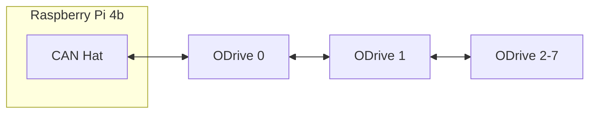
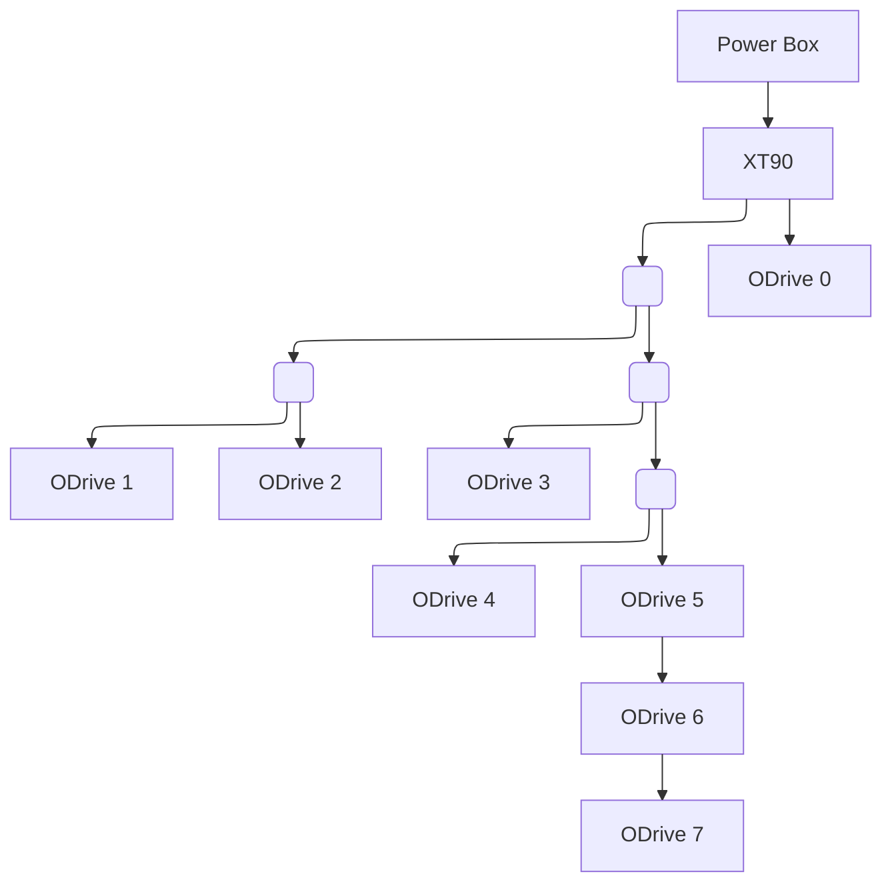

# dARM (dynamic Arm for Robitc Mischief)
dARM is a 3d printed 6 DOF robotic arm. Initially, I wanted to build a 3d printed arm as a test of my new `Bambu X1C`. I found most existing projects used stepper motors.  I wanted a better power density.

https://github.com/user-attachments/assets/527a8380-1c22-4416-9524-2030928b34a5

So the dARM journey began. The goal was to design a cheap, powerful, robust, modular, and easily maintained arm from scratch using `ODrive S1` BLDC controllers.  It stands `.975 meters` tall and can easily hold `5 lbs` in the horizontal position.

After iterating through various designs, modularity and maintenence became top priorities.  If any individual component fails, its modular section can be removed from the larger arm for easy replacement.

## Table of Contents
1. [Versions](#versions)
2. [Inspirations](#inspirations)
   - [James Burton](#james-burton)
   - [Skyentific](#skyentific)
   - [OpenQDD](#openqdd)
   - [SSG48 Gripper](#ssg48-gripper)
3. [Control](#control)
   - [Pi](#pi)
     - [Enable CAN Communication](#enable-can-communication)
     - [CAN Service](#can-service)
     - [Clone git repo](#clone-git-repo)
     - [Game Controllers](#game-controllers)
   - [CAN Wiring](#can-wiring)
4. [Power](#power)
   - [Power Box](#power-box)
   - [Power Wiring](#power-wiring)
5. [Mechanical](#mechanical)
   - [Primary Actuators](#primary-actuators)
   - [Forearm and Differential](#forearm-and-differential)
   - [Gripper](#gripper)
6. [Assembly](#assembly)
7. [Links](#links)

## Versions
Version numbers are determined purely by emotion. Don't ask what SDE stands for.

| Version   | Date          | Notes                             |
|---        | ---           | ---                               |
| 0.35 SDE  | 12/28/2024    | 6 axis, 7 motor design            |
| 0.45 SDE  | 1/17/2025     | Gripper v2 added                  |
| 0.55 SDE  | 1/28/2025     | Power box added                   |
| 0.56 SDE  | 3/15/2025     | New gripper motor magnet holder   | 
| 0.59 SDE  | 3/24/2025     | Dock and finger v4 added          | 

## Inspirations
Without the below projects and youtube channels the dARM project wouldn't exist.  I can't thank them enough for the inspiration and advice they've provided.

#### [James Burton](https://www.youtube.com/@jamesbruton)
What can I say about James.  I've been watching his channel for years.  Initially, because he did interesting things with 3d printed parts, but shortly after that because the things he did were so consistently interesting.  James introduced me to ODrives as a control mechansim for BLDC motors.

#### [Skyentific](https://www.youtube.com/@Skyentific)
Another great youtuber.  He focuses on robotic arms, mostly 3d printed robotic arms. He covers specifics of design, assembly, and control for several different robot arms.  He also covers ODrives in great detail, including a video that uses a custom modified firmware to increase communication speed for specific queries over CAN.

#### [OpenQDD](https://www.aaedmusa.com/projects/openqdd)
The basis for the primary actuators are the OpenQDD by Aaed Musa.  Aaed also has an excellent [youtube channel](https://www.youtube.com/@aaedmusa). We use the same basic layout of an `8308 motor`, an `ODrive S1`, and a `planetary gearbox`. Our actuators have been redesigned from scatch to increase strength and rigidity, tighten tolerances, print easier, and to have more robust mounting capabilities.

#### [SSG48 Gripper](https://source-robotics.github.io/SSG48-gripper-docs/page1_about_the_gripper)
The basis for the gripper is the SSG48 project.  We use a different motor, controller, and mounting dimensions, but we keep the basic motor housing layout, MGN7C rail/carriers, and a rack and pinion to move the fingers.

## Control
The dARM is controlled with a `Raspberry Pi 4b` communicating to eight `ODrive S1s` via `CAN bus`.  This is achieved with the help of an `RS485 CAN Hat` on the Pi.  The ODrives are using the built in encoder with `encoder magnets` attached to each motor.

In a CAN network, the controller does not require a node ID, but each device on the network must have one. From this point forward, assume that the term "node" refers specifically to an ODrive and that node IDs are zero-indexed.

### Pi
The Pi is currently running `Ubuntu 22.04 Server`, but everything should still work with newer versions.  Instructions for installing Ubuntu on a Pi can be found [here](https://ubuntu.com/tutorials/how-to-install-ubuntu-on-your-raspberry-pi#1-overview).  Set the hostname to `pidarm` and the username to `darm`.  It is also recommened to set a `static IP address` so it can be easily accessed via SSH.

#### Enable CAN Communication
The CAN Hat communicates to our ODrives, but it must also communicate to the Pi.  This is done through a `Serial Peripheral Interface (SPI)`. To enable the interface edit `/boot/firmware/config.txt` and add teh following at the bottom of the file:
```
dtparam=spi=on 
dtoverlay=mcp2515-can0,oscillator=12000000,interrupt=25 
dtoverlay=spi0-hw-cs
```
Reboot and run `dmesg | grep MCP2515` to verify the CAN Hat is now recognized.

Next we need to bring up the CAN interface with the following:
```
sudo ip link set can0 up type can bitrate 1000000
```
Then run `ip a` to veryify the interface is up.

Finally, install some handy CAN troubleshooting tools:
```
sudo apt-get install can-utils  <---- includes candump which can be used to see heartbeats from ODrives
sudo apt install python3-can    <---- includes CAN viewer script which can view all CAN traffic
```

#### CAN Service
A `systemd` service can be used to bring up the CAN interface on boot.  Create file `/etc/systemd/system/can0-setup.service` with the following contents:
```
[Unit]
Description=Set up CAN0 interface
After=network.target

[Service]
Type=oneshot
ExecStart=/sbin/ip link set can0 up type can bitrate 1000000

[Install]
WantedBy=multi-user.target
```

Then run the following commands:
```
sudo systemctl enable can0-setup.service
sudo systemctl start can0-setup.service
sudo systemctl status can0-setup.service
sudo reboot
```

Finally, run `ip a` to verify the CAN interface started on boot.

#### Clone git repo
`cd` to an appropriate directory and run `git clone https://github.com/JesseDarr/dARM.git` to clone the repo.  You will find the test scripts in the `odrive_tools` folder.  
> :bulb: **Note:**
> This folder is actually a git sub module that links to this repo: `https://github.com/JesseDarr/dARM_odrive_tools.git` 

#### Game Controllers
If you want to buy a cheap bluetooth dongle you can use an XBox One, XBox Series X, PS4 or PS5 controller with the `gamecontroller.py` script to control the dARM.  You will need to install the appropriate drives and use the `bluetoothctl` command to pair/connect the controller.  Run `ls /dev/input` and check for `js0` to ensure the controller is ready to work with the script.

Bluetooth on Linux is sketchy...bluetooth is sketchy...to combat this `reset_interfaces.sh` will reset the CAN and Bluetooth interfaces.  It can save a few reboots from time to time.

If using a Playstation Controller you also want to ensure the Sony module loads on boot.  Edit `/etc/modules` and add `hid-sony` to the bottom line.

### CAN Wiring
CAN wiring starts from the CAN Hat on the Pi.  A single `twisted pair` cable connects it to ODrive 0, which is then connected to ODrive 1, and so on with each ODrive daisy chained from the last like this:


It's not well documented, but the ODrive S1 includes two `4-pin JST-GH` ports.  Each ODrive has 1 cable connected to the previous node and 1 cable connected to the next node.  It does not matter which port is used for which cable.  This allows some freedom when building custom length CAN cables.


Be sure to enabled the `120ohm resistor on ODrive 7` by flipping the `DIP Switch` to `120R`.  All other ODrives should have this DIP Switch set to `No R`. 


The BOM lists sacrifical 4pin JST-GH wires.  You will need to cut them in half and solder them into twisted pair.  You need to wire the twisted pair in a `roll over` fashion such that `PIN 2 is wired to PIN 2`, and `PIN 3 is wired to PIN 3`.  It is recommend to  solder 1 end connector onto the tiwsted pair, attach it to an ODrive, and then measure the required length of that cable.

The cable that connects the PI to ODrive 0 is a special case: it must also include `PIN 4` for ground.  It should be wired into the `CAN Hat` like this:


## Power
Power is provided by a `1200W 48V switching power supply`.  While this voltage exceeds the motors’ nominal ratings, each motor typically draws only 2–3 amps and operates intermittently rather than under continuous load.

### Power Box
The `switching power supply` along with a `power monitor` and `power switch` are packaged up inside our `power box`.  AC power goes in one side and DC power comes out the other.


The inside looks like this:


Wiring diagram:


### Power Wiring
Power wiring is all 14 AWG except for the gripper motor which is powerd with 18 AWG.  It is likely that the forearm motors could also be powered with 18 AWG.

Wiring a robot arm is difficult.  Wiring is all custom length, and measured after the robot has been assembled.  This allows a wire to be screwed into an ODrive, the respective joint moved to its most distant position, and an appropriate length can be cut.

Wiring is also facilitated by `T Tap Connectors`.  These provide a T split at 90° and makes wiring much easier.  You can find them in the BOM.  Zip tie 2 of them bottom to bottom to handle both the positive and negative wires.  

Here is an overall power wiring diagram. 

> :bulb: **Note:**
> Each line in the diagram represents both postive and negative wires, and each empty square represents a `T Tap Connector`.

## Mechanical
The dARM sits on top of a base made of 6 legs each holding a 5lb weight to provide a solid base.  

Joints 0–3 provide a single axis of rotation each and are powered by the primary actuators. Joint 1 carries the highest load and uses a dual-motor setup to provide the necessary torque. 

The forearm uses two motors connected through a two-stage belt system to drive a differential, enabling two independent axes of rotation. 

The gripper uses a single motor to drive a pair of `Compliant TPU fingers`.

### Primary Actuators
These are the modular building blocks of joints 0-3. Each actuator use an `Eagle Power 8308` BLDC motor mated to a `9:1 planetary gearbox`. 

The gear box uses a `helical angle of 15°`, a `pressure angle of 15°`, and a `module of 1.4 mm`.  Here are the tooth counts:
| Gear   | Count |
|--------|----|
| Sun    | 8  |
| Planet | 28 |
| Ring   | 64 |

The `primary actuators` come in 2 flavors: `single bearing` and `double bearing`.  

Double bearing actuators handle load perpendicular to the rotation axis better. They are used in joints that rotates on the vertical axis. 

Single bearing actuators are used in joints that rotate on the horizontal axis. 
> :bulb: **Note:**
> Joint 1 uses 2 single bearing actuators for increased power. This also eliminates the need for a double bearing actuator.

Below is an explode animation of each flavor.  They should give you a good idea of the sub components involved and are also a good assembly reference.

https://github.com/user-attachments/assets/06c78a0a-1a54-4e00-952e-c247763e0280

https://github.com/user-attachments/assets/b43786ba-b51d-407c-8697-83d8e092f9be

### Forearm and Differential
The forearm uses two `GB36-2` BLDC motors connected through a pulley system to drive a differential.  

The pulley system consists of two-stages.  Each uses `20 tooth` and `72 tooth`pulleys connected via a `300 mm GT2 belt`.  This provides a ratio of `3.6:1` per stage and a final drive ratio of `12.96:1`

The motors oppose each other.  If they are driven in opposite directions then the differential will `bend` along the `X axis`.  If they are driven in the same direction then the differential will `twist` along the `Z axis`.  

Interestingly, this means both motors are in use for every movement the differential makes.  So the final drive ratio approaches a `potential maximum` of approximately `26:1`.

The differential uses `Zerol Bevel Gears` made with [Bevel Gear Maker](https://apps.autodesk.com/FUSION/en/Detail/Index?id=2427789559362467821&appLang=en&os=Win64).  They pinion and wheel gears each have `38 teeth` for a final ratio of `1:1`.  Other measurements needed to reproduce the gears:

| Parameter | Value |
|-----------|-------|
| Module    | 1.6 mm | 
| Pressure Angle | 25° 
| Face Width | 14 mm | |
| Clearance Factor | 0.3 mm | 

Below is an explode animation for the forearm.

https://github.com/user-attachments/assets/69bd7a27-f76a-4634-a556-fa9e3ffe39f6

### Gripper
| Module         | 1.4     |
| -------------- | ------- |
| Pressure Angle | 30      |
| Gear Teeth     | 8       |
| Gear Height    | 11.2 mm |
| Rack Heigh     | 7.7 mm  |
| Rack Depth     | 4 mm    |
| Rack Teeth     | 14      |
| Helic Mode     | normal  |

### Pillars

Explain why they are used, why they are better than a connected case.  air flow, looks cool, sheer force??? (find that video explination of bolted plates).  rigid connecting points for carrier adapters.

https://github.com/user-attachments/assets/7afa1675-455d-4928-a6e3-7bdbb0bead69

## Assembly
| Bolt | Hole Size |
| ---- | --------- |
| M3   | 3.4 mm    |
| M4   | 4.4 mm    |

Sanding
Fitting parts together
How tight to tigheten bolts
Glueing in nuts
Bottom Up
Different motor plates, keep track of them

Motor > Motor Plate > Bearing Holder > Carrier and rest of actuator > odrive last

### Oversized Things
 - Carrier outer diameter 75 + 0.2 mm
 - Carrier shafts diameter 12 + 0.05 mm
 - Sun gear shaft diameter 8 + 0.1 mm